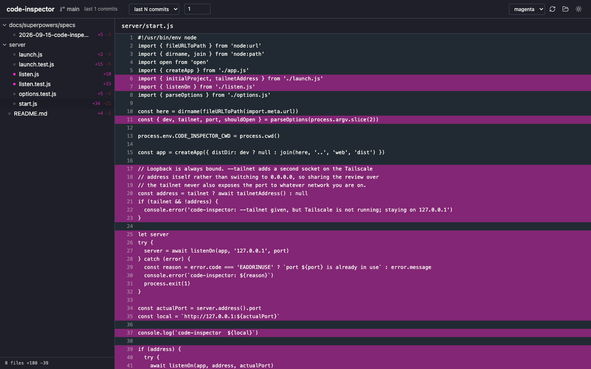

# code-inspector

A local web UI for reviewing everything changed on the current branch of a git
repository. File tree on the left, full file content on the right with changed
lines tinted.

Diff tools show you the hunks. This shows you the whole file, with the added,
changed and deleted lines tinted in place, so a change is always read in the
context it lives in.

Requires Node 20+ and git. Runs entirely on your machine; nothing is uploaded.

## Install

    ./install.sh

Builds the app and symlinks `code-inspector` into `~/.local/bin`, which needs no
password. `./install.sh --system` links into `/usr/local/bin` instead and asks
for sudo. The script warns if another `code-inspector` earlier in your PATH
would shadow the new one.

## Use

    cd ~/any/git/repo
    code-inspector

The launch directory wins; outside a repository it reopens the last project, or
offers a picker.

The server binds `127.0.0.1`, so it is reachable only from this machine. Passing
`--tailnet` also binds your Tailscale address and prints that URL, which lets
you read the diff from a phone or another laptop on your tailnet. Only the
Tailscale address is added, so the port stays invisible to whatever local
network you happen to be on. There is
no authentication, so anything on the tailnet can then read the whole open
repository — only use it on a tailnet you trust.

### Range

The header dropdown selects what "changed" means:

| Option | Base |
|---|---|
| auto | merge base with the upstream branch, else the root commit |
| working tree | HEAD |
| last N commits | HEAD~N |
| vs ref | any ref you type |

### Keys

| Key | Action |
|---|---|
| j / k | next / previous file |
| n / p | next / previous change in the file |
| r | refresh |

## Configuration

`~/.config/code-inspector/config.json` holds the colour tokens for both themes,
the default theme, the maximum file size and the line height. Edit it and reload
the page; no rebuild is needed.

`~/.config/code-inspector/state.json` is written by the app and holds the last
project, the recent list and the theme choice.

## Development

    npm run dev     # vite on 5173, api on 5174
    npm test

## License

MIT — see [LICENSE](LICENSE).
